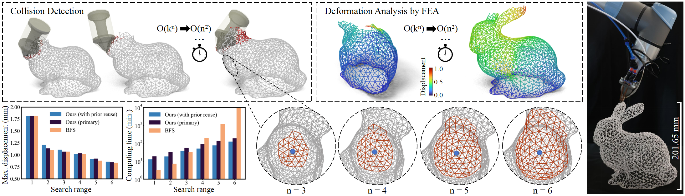
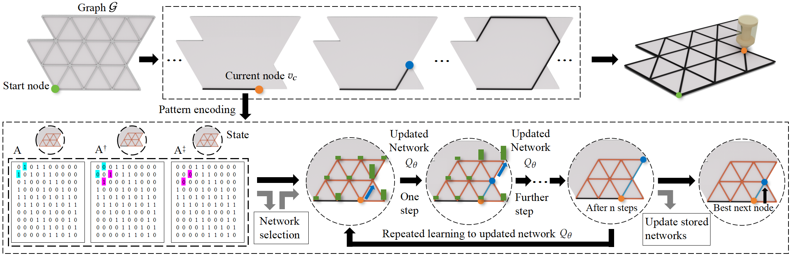
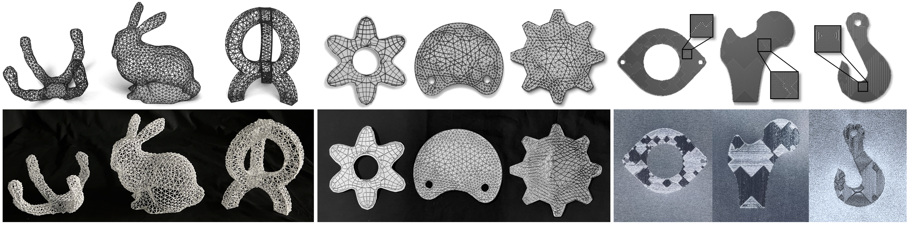

# RL-based-planner-for-3D-printing-toolpath

This paper presents an efficient reinforcement learning (RL) based planner for computing optimized 3D printing toolpaths, which can work on graphs on large scales by constructing the state space on-the-fly. The planner can cover different 3D printing applications by defining their corresponding reward functions and state spaces. Toolpath generation problems in wire-frame printing, continuous fiber printing, and metallic printing are selected here to demonstrate generality. The resultant toolpaths have been applied in physical experiments to verify the performance of the planner. By this planner, wire-frame models with up to 3.3k struts can be successfully printed, up to 93.3% of sharp turns on continuous fiber toolpaths can be avoided, and the thermal distortion in metallic printing can be reduced by 24.9%.

# Installation

**Platform:** Windows 10/11

**Environment:** python 3.9 + pyTorch 1.12

**Package:** numpy + matplotlib + networkx + scipy

# Usage

**Step 1:** Open the **main.py** file

**Step 2:** Change the **env_name** to your model. We provide 9 initial models corresponding to wireframe, CCF and metal printing.

**Input file formats:**

The input txt files are under the **data** folder:

Number of nodes in the input graph:

Three-dimensional coordinates of nodes: X Y Z.

Number of edges in the input graph:

The corresponding node indexes on each edge: head index, tail index.

**Step 3:** Change the size of the **LSG range**. The default is 6.

**Step 4:** Run the **main.py** file. 

**Step 5:** Wait for the progress bar to reach the end and finish post-processing. Check the figure folder to see the final generated graph.

**Step 6:** Then we get the output file, which is divided into results and outputs.

**Output file formats:**

The result txt files are under the **results** folder:

Index of nodes in print order: first node, second node, ... , final node.

The output txt files are under the **outputs** folder:

Three-dimensional coordinates of nodes: X Y Z , and printing normal: nx ny nz.

